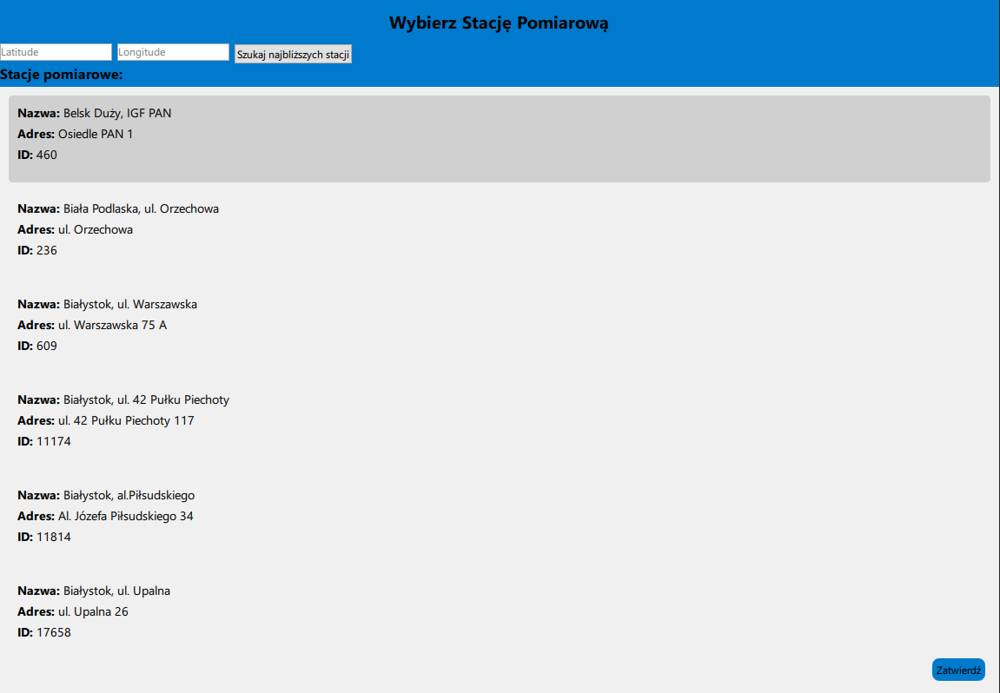

# JPO-pogoda-cpp
Projekt na zaliczenie cpp, korzystający z API GIOŚ


# Polish Air Quality Monitor

A Qt-based desktop application that visualizes real-time air quality data from Poland's official environmental API. Users can view detailed station measurements, explore data trends, filter by date ranges, and see the closest stations based on coordinates.



## Features

- Live data from the Polish Environmental Monitoring API (GIOŚ)
- Interactive ChartView using QtCharts
- Date range filtering: 24 hours, 3 days, or 7 days
- Browse air quality measurement stations and their parameters
- Find the 5 closest stations based on geographic coordinates
- Local JSON database for caching station data and measurements
- Trend analysis: average, min, max calculations
- Navigation between views using StackView


## Technologies
- Qt 6
- QML for UI
- C++ backend
- QtCharts for plotting
- QNetworkAccessManager for API communication
- JSON parsing with QJsonDocument and QJsonObject
  
## Setup

### Requirements

- Qt Creator or a Qt build environment
- Qt version 6.8.3 or Qt 6.0+ (for modules like `QtQuick 2.15`, `QtCharts 2.15`).
  
This project uses the following Qt modules:

- **QtCore**: Core functionality of Qt, including event handling, time and date management, etc.
- **QtWidgets**: A module providing a set of UI elements like buttons, windows, and text fields.
- **QtTest**: The testing module for Qt, used for unit testing.
- **QtQuick**: Provides features for building user interfaces using QML and JavaScript.
- **QtQuick.Controls**: QML-based UI controls (like buttons, sliders, etc.).
- **QtCharts**: Provides charting functionalities for graphical representations of data.
- **QtQml**: Used for integrating C++ with QML and managing the object model between the two.
- **QtNetwork**: For network programming, such as HTTP requests.
- **QtMultimedia**: If your project needs multimedia (audio, video, etc.).

### Required Qt Version:


### Installation

Clone the repo and open the `.pro` file in Qt Creator:

```bash
git clone https://github.com/CassEatsGlass/JPO-pogoda-cpp.git
cd JPO-pogoda-cpp
```
### Running
```cmd
windeployqt --qmldir=C:/Qt/6.8.3/mingw_64/qml ./build/stacje_pomiarowe.exe
```
