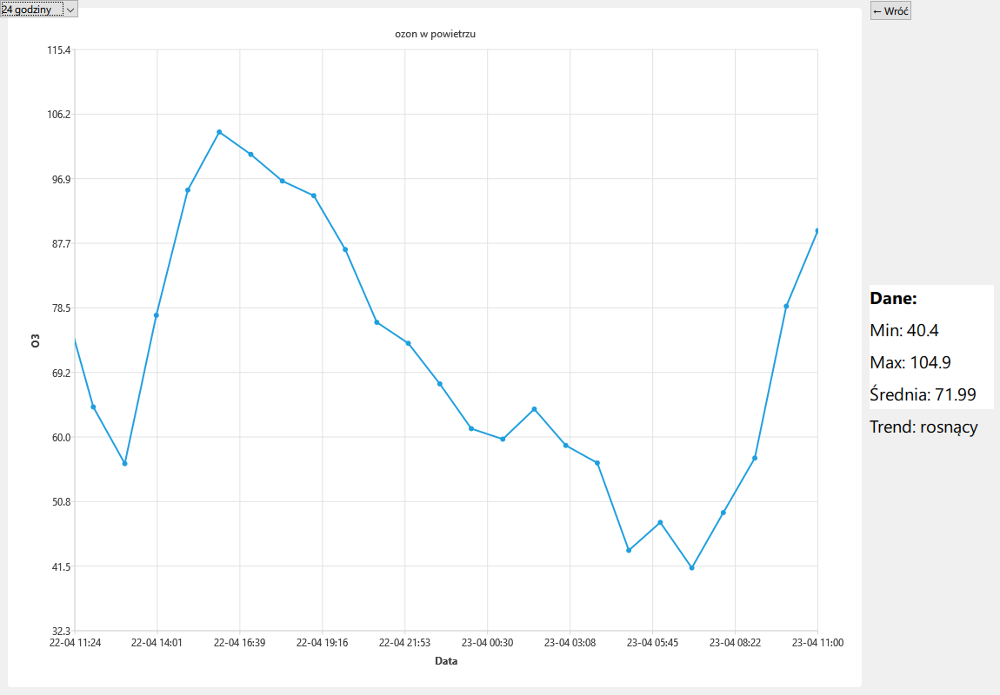

# JPO-pogoda-cpp
Projekt na zaliczenie cpp, korzystający z API GIOŚ


# Polish Air Quality Monitor

A Qt-based desktop application that visualizes real-time air quality data from Poland's official environmental API. Users can view detailed station measurements, explore data trends, filter by date ranges, and see the closest stations based on coordinates.


## Features

- Live data from the Polish Environmental Monitoring API (GIOŚ)
- Interactive ChartView using QtCharts
- Date range filtering: 24 hours, 3 days, or 7 days
- Browse air quality measurement stations and their parameters
- Find the 5 closest stations based on geographic coordinates
- Local JSON database for caching station data and measurements
- Trend analysis: average, min, max calculations
- Navigation between views using StackView


## Technologies
- Qt 6
- QML for UI
- C++ backend
- QtCharts for plotting
- QNetworkAccessManager for API communication
- JSON parsing with QJsonDocument and QJsonObject
  
## Setup

### Requirements

- Qt Creator or a Qt build environment
- Qt version 6.8.3 or Qt 6.0+ (for modules like `QtQuick 2.15`, `QtCharts 2.15`).
  
This project uses the following Qt modules:

- **QtCore**
- **QtWidgets**
- **QtTest**
- **QtQuick**
- **QtQuick.Controls**
- **QtCharts**
- **QtQml**
- **QtNetwork**
- **QtMultimedia**

### Required Qt Version:


### Installation

Clone the repo and open the `.pro` file in Qt Creator:

```bash
git clone https://github.com/CassEatsGlass/JPO-pogoda-cpp.git
cd JPO-pogoda-cpp
```
### Running
```cmd
windeployqt --qmldir=C:/Qt/6.8.3/mingw_64/qml ./build/stacje_pomiarowe.exe
```
